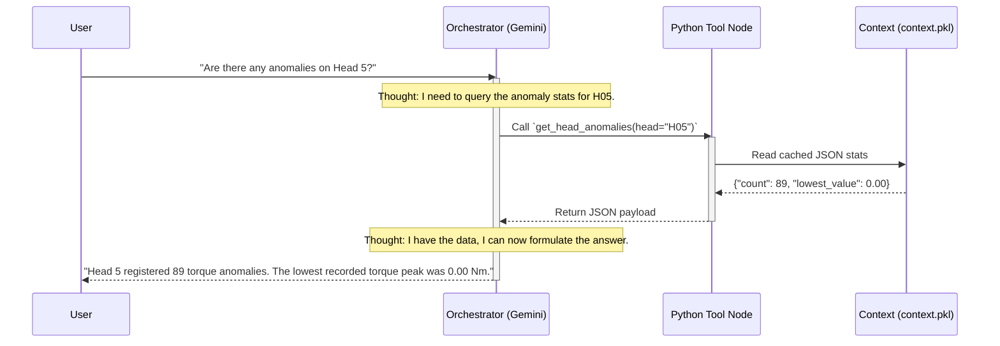

# Agent Decision Flow (Agentic Orchestrator)

The `AgenticOrchestrator` (Layer 4) serves as the conversational bridge between the human operator and the vast telemetry dataset. Instead of relying on a standard "chat" model that might hallucinate numbers or formulas, the system implements a strict **ReAct (Reason + Act)** loop powered by LangGraph and Google Gemini.

---

## 1. The ReAct Architecture

---

## 2. System Prompt & Persona

To prevent the LLM from generating unverified advice, the Orchestrator is initialized with a highly constrained System Prompt. 
* **Persona**: An expert industrial data analyst and maintenance technician working on AROL capping machines.
* **Temperature**: Set to `0.0` (or extremely low) to ensure deterministic, highly focused, and repeatable phrasing.
* **Constraints**: The LLM is strictly instructed *never* to perform arithmetic calculations on its own. It must rely entirely on the outputs of the deterministic Python tools.

---

## 3. Tool Registry (The Agent's Abilities)

The agent is equipped with a strict registry of Python functions (tools). It cannot run arbitrary code; it can only invoke these predefined methods. When the LLM is initialized, the docstrings and type hints of these tools are injected into its context.

Examples of deterministic tools mapped to the LLM:
* `get_overall_kpis()`: Retrieves total cycles, production speeds, and overall success rates from `context.pkl`.
* `get_head_performance(head_id: str)`: Fetches torque averages, standard deviations, and closure counts for a specific head (e.g., `"H01"`).
* `get_anomaly_summary()`: Lists the heads with the highest frequency of statistical outliers.
* `get_idle_periods()`: Returns the list of machine downtimes and their exact durations.

---

## 4. Worked Example: A ReAct Trace

Here is a step-by-step breakdown (a "trace") of what happens internally in the LangGraph execution space when a user asks a complex question.

**User Query:** *"Which machine head is performing the worst today?"*

1. **Thought (LLM Internal):** The user wants to know the worst-performing head. I should check the overall success metrics and torque statistics across all heads.
2. **Action (LLM -> Tool):** The LLM autonomously invokes the mapped Python tool `get_all_head_metrics()`.
3. **Observation (Python -> LLM):** The Python tool executes in the backend, reads the `context.pkl` dictionary in $O(1)$ time, and returns a JSON array: 
   `[{"head": "H12", "success_rate": 99.1}, {"head": "H01", "success_rate": 99.99}, ...]`
4. **Thought (LLM Internal):** I can see from the returned JSON payload that H12 has the lowest success rate at 99.1%.
5. **Response (LLM -> User):** *"Based on the telemetry data, Head 12 is currently the worst-performing head, with a success rate of 99.1%. I recommend checking it for mechanical wear."*

---

## 5. Guardrails and Safety

* **Fail-Fast Initialization**: If a user starts `bot.py` before running the data pipeline (`main.py` or `demo.py`), the bot immediately halts and instructs the user to generate `context.pkl` first. It refuses to operate without physical data.
* **Data Bounds & AI Transparency**: The LLM is fed a `confidence_and_limits` list directly from the analytics engine (e.g., *"Residual correlation highlights shared stress, but does not imply structural causation"*). The LLM is instructed to append these disclaimers when rendering complex statistical advice, ensuring safe engineering practices are maintained.
