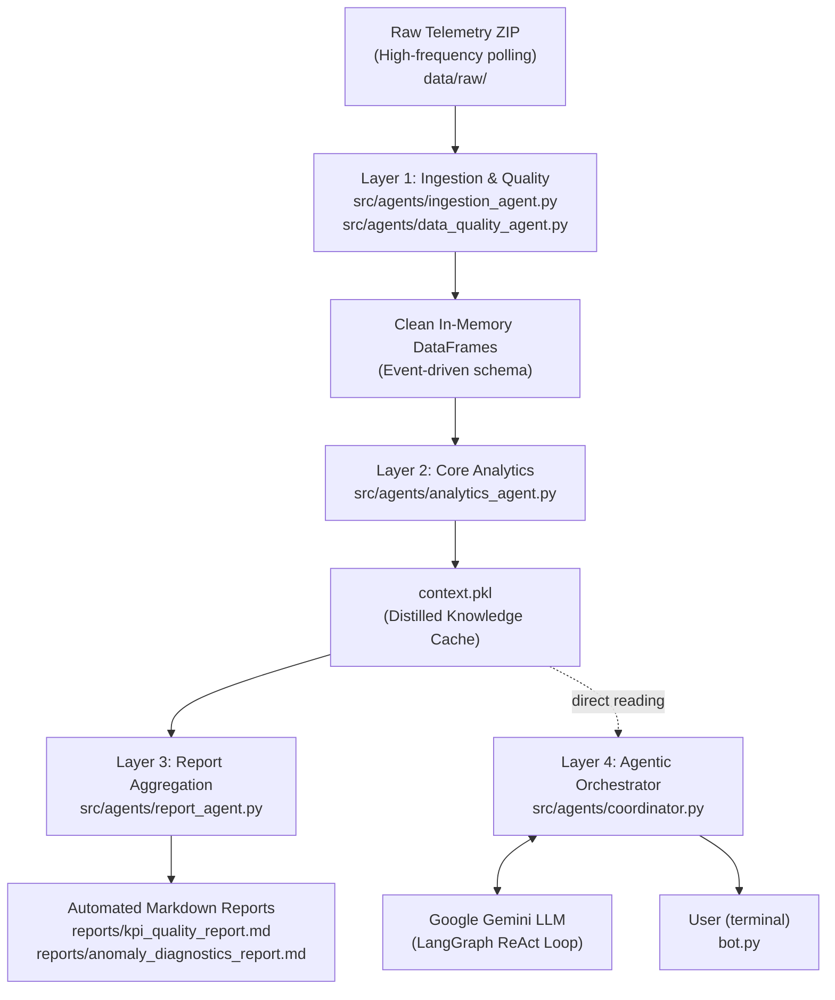

# Architecture

## System Overview

The Multi-Agent Data Processor is a decentralized, four-layer pipeline designed to transform high-frequency industrial telemetry into structured analytical reports and natural language insights. 

---

## Layer 1 — Data Ingestion & Quality

`src/agents/ingestion_agent.py` and `src/agents/data_quality_agent.py` form the foundational data ingestion and sanitization layer.

**Ingestion & Streaming:** The pipeline is built to handle massive 55M+ row datasets without disk I/O bottlenecks. The `IngestionAgent` employs a Direct-to-RAM streaming protocol, reading wide-format CSV or Parquet files directly from compressed `.zip` archives (ignoring macOS system artifacts like `__MACOSX`). It dynamically scans headers to adapt to machines with any number of heads (e.g., 36 or 48).

**Event Extraction (Deduplication):** Raw telemetry is polluted with asynchronous "polling noise" (the PLC reporting the same state thousands of times per second). The `DataQualityAgent` applies a discrete derivative (`pandas.shift(1)`) to the cumulative counter. Any row where the difference is `0` is discarded. This immediately reduces the RAM footprint by ~90%, keeping only the exact timestamps of physical mechanical closures.

**Quality Flagging:** Remaining events are validated against expected status codes (`0`, `2`, `65`). The agent detects and flags structural anomalies:
* `Data Gaps`: When the elapsed time between events exceeds expected limits.
* `Counter Recoveries`: When a PLC counter suddenly resets or jumps from zero.
* `Counter Drops`: Negative increments signaling a mechanical or software reset.

---

## Layer 2 — Core Analytics

`src/agents/analytics_agent.py` acts as the strict, deterministic mathematical engine of the system. 

**Stateless Computations:** Operating over the clean event-driven DataFrame, the agent calculates highly specific mechanical KPIs:
* **Throughput Speeds:** Both `Machine Cycle Speed` (all events) and `Machine Production Speed` (excluding No Load).
* **Torque Outliers (IQR):** Calculates the Interquartile Range dynamically per-head to flag statistical torque anomalies, using strict 3.0 multipliers to prevent false positives.
* **Torque Drift Tracking:** Computes a 7-day moving average baseline to identify fatigue (e.g., tension springs relaxing over time).
* **Residual Head Correlation:** Subtracts the daily machine average to calculate Pearson correlations on *residual* torque, isolating shared mechanical wear between specific heads.
* **Downtime Detection:** Scans for contiguous blocks where all heads report a `No Load` status for more than 60 seconds to track machine idle time.

**State Purging (Memory Optimization):** Once all calculations are complete, the `AnalyticsAgent` explicitly deletes the massive Pandas DataFrames from system memory. The findings are distilled into a lightweight (~10KB) JSON-serializable Python dictionary, guaranteeing that subsequent layers can operate instantly without Out-Of-Memory crashes.

---

## Layer 3 — Report Aggregation

`src/agents/report_agent.py` (and the evaluation script `demo.py`) handles the compilation and formatting of the findings.

**Knowledge Distillation:** The `ReportAgent` takes the outputs of Layer 2 and structures them into `context.pkl`. This dictionary is strictly typed and includes derived metrics like overall success rates, worst-performing heads, and confidence limits (warnings that LLMs must respect).

**Automated Markdown Generation:** To fulfill official documentation requirements without risking LLM hallucination, `demo.py` statically generates highly structured Markdown files (`reports/kpi_quality_report.md` and `reports/anomaly_diagnostics_report.md`). 
* The engine uses deterministic Python loops to render rich ranking tables (e.g., all 36 heads ranked by Success %).
* Values like `0.00 Nm` lowest peaks are accurately reflected from the statistical IQR module, ensuring engineering precision over AI-generated guesswork.

---

## Layer 4 — Agentic Orchestrator (Bot)

`src/agents/coordinator.py` and `bot.py` act as the cognitive frontend, providing a natural language interface over the complex data.

**The LLM Backend:** The system leverages Google's Gemini LLM (configurable via `GOOGLE_API_KEY`). Unlike monolithic RAG setups, the LLM is **never** asked to perform mathematical operations or parse CSVs directly.

**LangGraph ReAct Loop:** The Orchestrator operates on a *Reason and Act* (ReAct) paradigm. 
1. **Think:** The LLM receives a user question (e.g., *"What is the worst performing head?"*) and evaluates the available tools in its registry.
2. **Act:** It selects the appropriate Python tool (e.g., `get_head_performance()`) and executes it.
3. **Observe:** The tool queries the distilled `context.pkl` cache—returning data in $O(1)$ time (instantaneously, since the math was pre-computed by Layer 2).
4. **Respond:** The LLM receives the raw, mathematically perfect JSON data and formats it into a polite, professional natural-language response for the terminal.

**Fail-Safe Operation:** Because the backend is strictly decoupled from the frontend, if the LLM goes offline or the API key expires, the data pipeline (Layers 1-3) continues to function perfectly, ensuring AROL operators are never locked out of their industrial reports.
